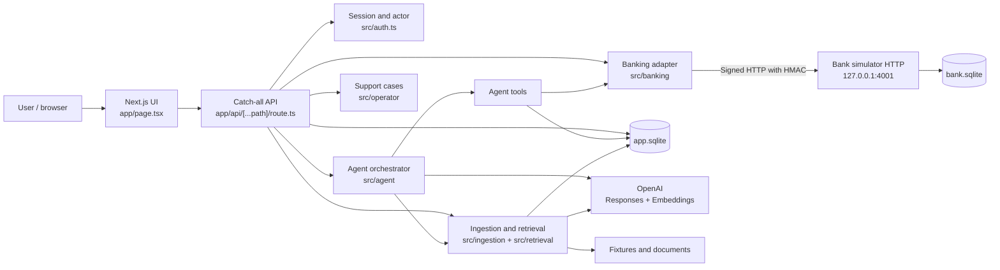
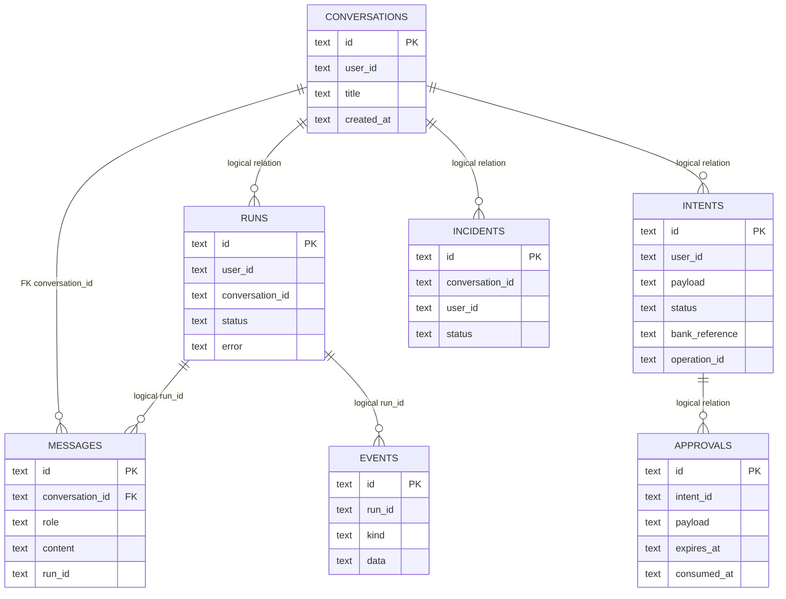
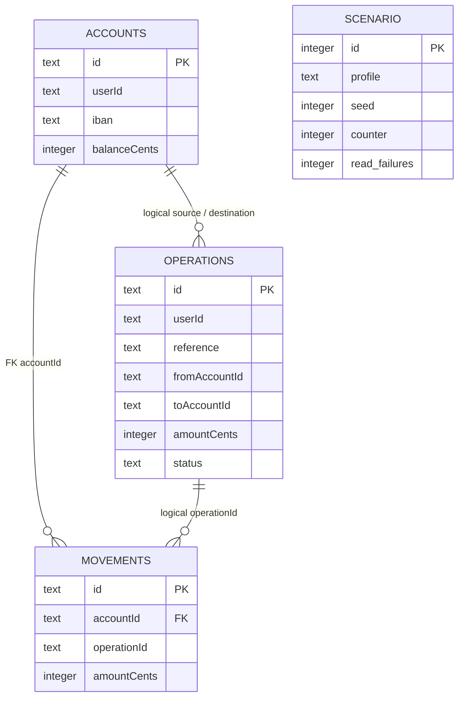

# System overview diagrams

Open this file with Cursor's Markdown preview to render the Mermaid diagrams.

## Current architecture

```mermaid
flowchart LR
    U["User / browser"]
    UI["Next.js UI<br/>app/page.tsx"]
    API["Catch-all API<br/>app/api/[...path]/route.ts"]
    AUTH["Session and actor<br/>src/auth.ts"]
    AG["Agent orchestrator<br/>src/agent"]
    TOOLS["Agent tools"]
    RAG["Ingestion and retrieval<br/>src/ingestion + src/retrieval"]
    OPS["Support cases<br/>src/operator"]
    BANK["Banking adapter<br/>src/banking"]
    APPDB[("app.sqlite")]
    OPENAI["OpenAI<br/>Responses + Embeddings"]
    SIM["Bank simulator HTTP<br/>127.0.0.1:4001"]
    BANKDB[("bank.sqlite")]
    FIX["Fixtures and documents"]

    U --> UI
    UI --> API

    API --> AUTH
    API --> AG
    API --> OPS
    API --> RAG
    API --> BANK
    API --> APPDB

    AG --> RAG
    AG --> OPENAI
    AG --> TOOLS

    TOOLS --> BANK
    TOOLS --> APPDB

    RAG --> OPENAI
    RAG --> APPDB
    RAG --> FIX

    BANK -->|"Signed HTTP with HMAC"| SIM
    SIM --> BANKDB
```

## Application database

```mermaid
erDiagram
    CONVERSATIONS ||--o{ MESSAGES : "FK conversation_id"
    CONVERSATIONS ||--o{ RUNS : "logical relation"
    RUNS ||--o{ MESSAGES : "logical run_id"
    RUNS ||--o{ EVENTS : "logical run_id"
    CONVERSATIONS ||--o{ INTENTS : "logical relation"
    CONVERSATIONS ||--o{ INCIDENTS : "logical relation"
    INTENTS ||--o{ APPROVALS : "logical relation"

    CONVERSATIONS {
        text id PK
        text user_id
        text title
        text created_at
    }

    MESSAGES {
        text id PK
        text conversation_id FK
        text role
        text content
        text run_id
    }

    RUNS {
        text id PK
        text user_id
        text conversation_id
        text status
        text error
    }

    INTENTS {
        text id PK
        text user_id
        text payload
        text status
        text bank_reference
        text operation_id
    }

    APPROVALS {
        text id PK
        text intent_id
        text payload
        text expires_at
        text consumed_at
    }

    INCIDENTS {
        text id PK
        text conversation_id
        text user_id
        text status
    }

    EVENTS {
        text id PK
        text run_id
        text kind
        text data
    }
```

## Bank database

```mermaid
erDiagram
    ACCOUNTS ||--o{ MOVEMENTS : "FK accountId"
    ACCOUNTS ||--o{ OPERATIONS : "logical source / destination"
    OPERATIONS ||--o{ MOVEMENTS : "logical operationId"

    ACCOUNTS {
        text id PK
        text userId
        text iban
        integer balanceCents
    }

    OPERATIONS {
        text id PK
        text userId
        text reference
        text fromAccountId
        text toAccountId
        integer amountCents
        text status
    }

    MOVEMENTS {
        text id PK
        text accountId FK
        text operationId
        integer amountCents
    }

    SCENARIO {
        integer id PK
        text profile
        integer seed
        integer counter
        integer read_failures
    }
```